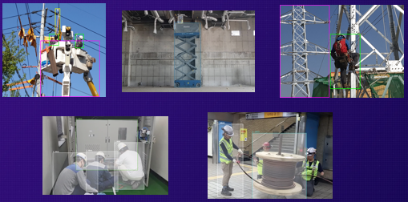
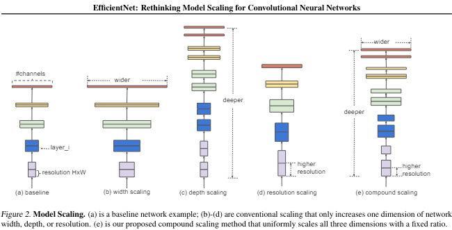
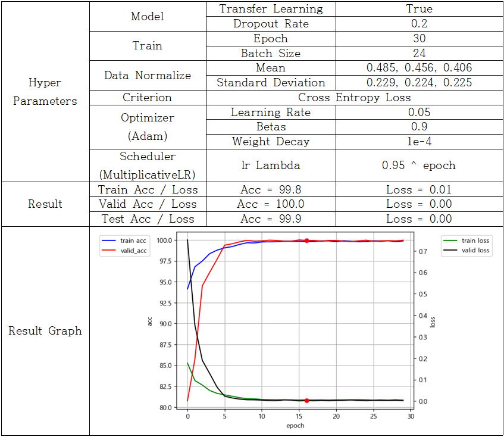
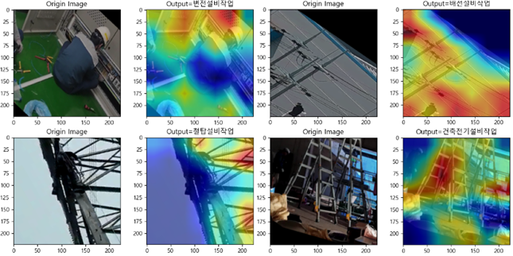
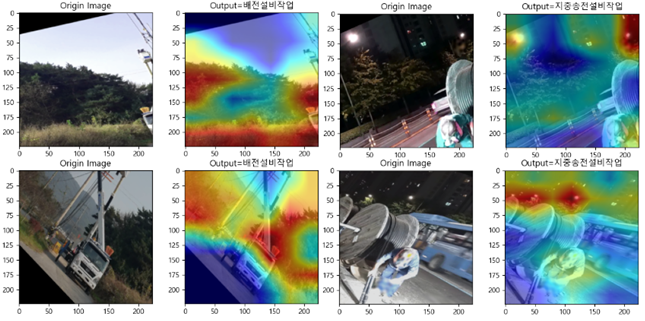

# Competition Overview

### Result - 🏆 Grand Prize (1st Place)

### Industrial safety data AI Hackathon

- **2023 AI Training Data Construction Support Program**
  - No. 63: Construction Site Safety Data
  - No. 63-2: Risk State Judgment Data for Electrical Equipment Construction Sites

### Organizer
- NIA (National Information Society Agency, Korea)
- Ilju GNS Co., Ltd.

### Theme
<Track 2>
> Development of a Work Process Classification Model Using Risk State Data from Electrical Equipment Construction Sites
- Safety equipment data worn by workers at shipbuilding / offshore plant smart yard sites were used to train an EfficientNet-based model for classifying work processes.

1. Power Distribution Equipment Work
2. Building Electrical Equipment Work
3. Transmission Tower Equipment Work
4. Substation Equipment Work
5. Underground Transmission Equipment Work

### Model Used for Training
> EfficientNet-B0

Paper: [https://arxiv.org/abs/1905.11946](https://arxiv.org/abs/1905.11946)

### Final Submission
- [231215_01.ipynb](jiho/231215_01.ipynb)
- [231215_01.pt](jiho/231215_01.pt)

### Model Interpretation (Grad-CAM Analysis)
- Correctly Classified Cases

 
- Transmission tower work: focused on the tower structure
- Power distribution work: focused on power lines
- Substation work: focused on substation-related equipment
- Building electrical work: focused on objects such as power lines and ladders

This indicates that the model learned semantically meaningful visual features relevant to each work process.

- Incorrectly Classified Cases

 
- The model made predictions based on background features such as trees or sky instead of task-related objects.
- In particular, for underground transmission work, many training images were captured at night.
  As a result, images with a night sky background were frequently misclassified as this process.

### Development Environment
- Python 3.9 with Venv
- pytorch torchvision pytorch-cuda=12.1 numpy, Pillow, scikit-learn, matplotlib
- grad-cam, [https://github.com/jacobgil/pytorch-grad-cam](https://github.com/jacobgil/pytorch-grad-cam)
- EfficientNet:	[https://github.com/lukemeals/EfficientNet-PyTorch](https://github.com/lukemelas/EfficientNet-PyTorch)

- Font for Pyplot: 맑은고딕

### Contributor
- [Donghoon Lee](https://github.com/bluelemon61): Training pipeline design, Model training, analysis, and optimization
- [Jiho Kim](https://github.com/jiho7407): Model training and optimization, Selection of best-performing model
- [Seungjin Yoo](https://github.com/starjrm00): Final result aggregation and analysis, Report writing
