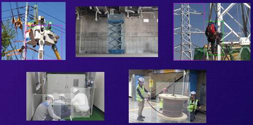
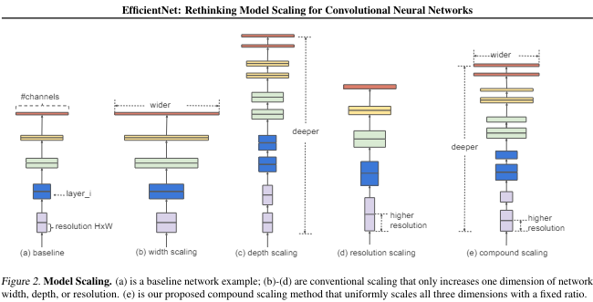
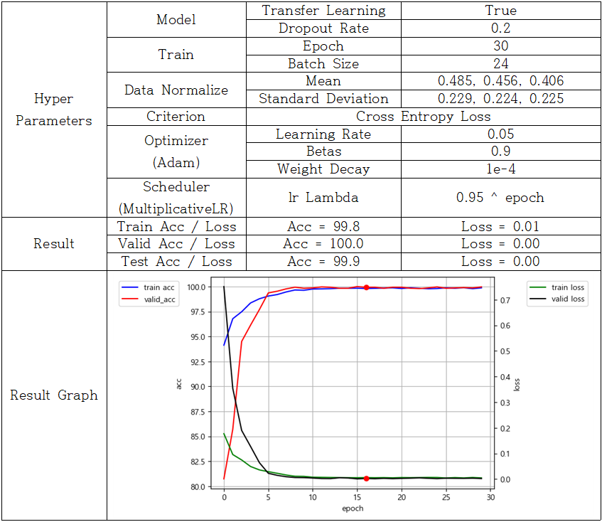
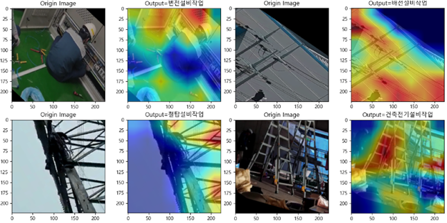
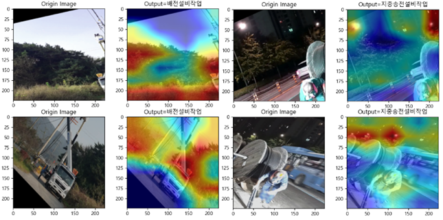

# 대회 개요
GitHub: [https://github.com/bluelemon61/Industrial_safety_data_AI_Hackathon](https://github.com/bluelemon61/Industrial_safety_data_AI_Hackathon)

### 결과 - 대상

### 공사현장 안전데이터 AI 해커톤

- **2023년도 인공지능 학습용 데이터 구축 지원사업**
  - 63번 공사현장 안전데이터
  - 63-2 전기 설비 공사 현장 위험 상태 판단 데이터

### 주최
- NIA, 한국지능정보사회진흥원
- (주)일주지앤에스

### 주제
<제 2분야>
> 전기 설비 공사 현장 위험 상태 판단 데이터를 활용한 작업공정 분류모델 개발
- 선박/해양플랜트 스마트야드 현장 내에서 작업자들이 착용하는 안전장비 데이터를 Efi 모델로 학습하여 해당 작업공정 분류

1. 배전설비 작업
2. 건축전기설비 작업
3. 철탑설비 작업
4. 변전설비 작업
5. 지중송전 설비 작업

### 데이터 학습 활용 모델
> EfficientNet-B0

Paper: [https://arxiv.org/abs/1905.11946](https://arxiv.org/abs/1905.11946)

### 최종 제출 모델
- [231215_01.ipynb](jiho/231215_01.ipynb)
- [231215_01.pt](jiho/231215_01.pt)

- 모델이 올바르게 분석한 Case

철탑의 경우 철탑만, 배전설비 작업은 전선, 변전 설비 작업은 변전 관련 설비, 건축 전기 설비 작업은 전선과 사다리 등의 사물을 보고 판단을 내린 것을 알 수 있다.

- 모델이 올바르지 않게 분석한 Case

해당 공정과 관련된 사물이 아닌 나무와 하늘과 같은 배경을 보고 분류 결정을 내린 것을 확인 할 수 있다. 특히 지중 송전 설비 작업과 같은 경우, 학습 데이터 중 야간에 촬영된 사진이 많아 하늘이 밤하늘이라면 해당 공정으로 분류한 사례가 많았다.

### 개발 환경
- Python 3.9 with Venv
- pytorch torchvision pytorch-cuda=12.1 numpy, Pillow, scikit-learn, matplotlib
- grad-cam, https://github.com/jacobgil/pytorch-grad-cam
- EfficientNet:	
https://github.com/lukemeals/EfficientNet-PyTorch

- Font for Pyplot: 맑은고딕

### Contributor
- [이동훈](https://github.com/bluelemon61): 학습 코드 설계, 학습 및 분석, 모델 학습 및 최적화
- [김지호](https://github.com/jiho7407): 모델 학습 및 최적화, Best 모델 도출
- [유승진](https://github.com/starjrm00): 최종 결과 종합 및 분석, 보고서 작성